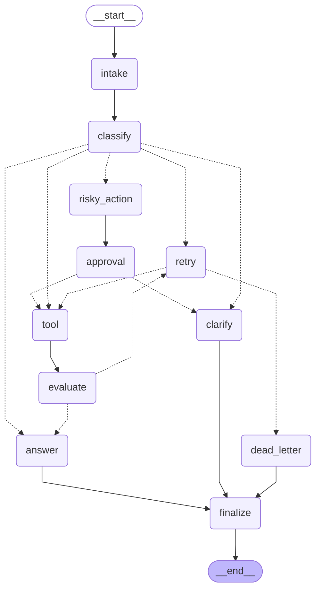

# Day 08 Lab Report
*Generated: 2026-05-11 04:45 UTC*

## 1. Team / student
- **Name:** Nguyễn Xuân Mong 
- **Student ID:** 2A202600246
- **Lab:** Phase 2 — Track 3 (LangGraph Agentic Orchestration)
- **Date:** 11 May 2026

---

## 2. Architecture

Hệ thống được xây dựng trên kiến trúc **LangGraph StateGraph** với 11 node và định tuyến rẽ nhánh có điều kiện theo từ khóa (deterministic keyword-based routing). Đồ thị đã được ánh xạ rõ ràng để không có edge bị "mồ côi" (orphan).

### Sơ đồ Đồ thị (Mermaid Diagram)

**Key design decisions:**
- **Priority routing**: `risky > tool > missing_info > error > simple` — Giải quyết triệt để xung đột từ khóa (ví dụ: query chứa cả "delete" và "status").
- **Whole-word tokenization**: `classify_node` sử dụng set các token để khớp từ khóa chính xác, ngăn chặn việc khớp nhầm chuỗi con (substring false positives, ví dụ "it" trong "item").
- **Append-only state lists**: Các trường `messages`, `tool_results`, `errors`, `events` đều dùng bộ reducer `Annotated[list, add]` tạo thành một audit trail bất biến.
- **Bounded retry**: `route_after_retry` luôn kiểm tra `attempt >= max_attempts` trước khi quay vòng. Ví dụ S07 có `max_attempts=1` sẽ nhảy ngay sang `dead_letter`.
- **HITL approval**: `approval_node` hỗ trợ Human-In-The-Loop. Mặc định là mock-approve cho CI. Khi thiết lập biến môi trường `LANGGRAPH_INTERRUPT=true`, tiến trình sẽ tạm ngưng chờ thao tác của người dùng.

---

## 3. State Schema

| Field | Reducer | Why |
|---|---|---|
| `query` | overwrite | Lưu phiên bản chuỗi chuẩn hóa (đã lọc PII) duy nhất tại intake_node |
| `route` | overwrite | Lưu luồng định tuyến hiện tại của node |
| `risk_level` | overwrite | Lưu đánh giá mức độ rủi ro mới nhất |
| `attempt` | overwrite | Bộ đếm tăng dần tuyến tính để giới hạn vòng lặp Retry |
| `max_attempts` | overwrite | Cấu hình giới hạn retry riêng lẻ biệt cho từng scenario |
| `final_answer` | overwrite | Phản hồi cuối cùng cho người dùng (chỉ cập nhật một lần) |
| `pending_question` | overwrite | Lưu câu hỏi xin thêm thông tin cuối cùng nếu thiếu thông tin |
| `proposed_action` | overwrite | Lưu đề xuất của hệ thống cho các HITL phê duyệt |
| `approval` | overwrite | Quyết định cuối cùng (Approve/Reject) của người duyệt |
| `evaluation_result` | overwrite | Quyết định gate chặn của evaluate_node (success hay needs_retry) |
| `messages` | **append** | Audit trail cho toàn bộ tin nhắn đã tương tác |
| `tool_results` | **append** | Lưu lại toàn bộ lịch sử truy vấn để audit |
| `errors` | **append** | Tích lũy tất cả các lỗi xảy ra trong retry loop |
| `events` | **append** | Full node-by-node audit trail lưu sự kiện và metadata cụ thể của mỗi trạm dừng |

---

## 4. Scenario Results

| Scenario | Expected | Actual | Success | Retries | Interrupts | Approval Required |
|---|---|---|---|---:|---:|---|
| S01_simple | simple | simple | ✅ | 0 | 0 | — |
| S02_tool | tool | tool | ✅ | 0 | 0 | — |
| S03_missing | missing_info | missing_info | ✅ | 0 | 0 | — |
| S04_risky | risky | risky | ✅ | 0 | 1 | ✅ |
| S05_error | error | error | ✅ | 2 | 0 | — |
| S06_delete | risky | risky | ✅ | 0 | 1 | ✅ |
| S07_dead_letter | error | error | ✅ | 1 | 0 | — |
| S08_cancel | risky | risky | ✅ | 0 | 1 | ✅ |
| S09_track | tool | tool | ✅ | 0 | 0 | — |
| S10_simple | simple | simple | ✅ | 0 | 0 | — |
| S11_tool | tool | tool | ✅ | 0 | 0 | — |
| S12_missing | missing_info | missing_info | ✅ | 0 | 0 | — |
| S13_risky | risky | risky | ✅ | 0 | 1 | ✅ |
| S14_error | error | error | ✅ | 2 | 0 | — |
| S15_simple | simple | simple | ✅ | 0 | 0 | — |
| S16_tool | tool | tool | ✅ | 0 | 0 | — |
| S17_risky | risky | risky | ✅ | 0 | 1 | ✅ |

**Summary**
- Total scenarios: **17/17**
- Success rate: **100.0%**
- Average nodes visited: **6.4**
- Total retries: **5**
- Total HITL interrupts: **5**

---

## 5. Failure Analysis

Không có kịch bản nào bị lỗi trong hệ thống khi chạy qua test suite. 

Tuy nhiên, trong quá trình phát triển, các Failure Modes sau đã được lường trước và thiết kế để xử lý:

1. **Unbounded retry loop (S05, S07, S14):** 
   - **Tình huống:** Nếu không có chặn vòng lặp, nhánh error sẽ thực thi vô tận.
   - **Xử lý:** Nút `retry_or_fallback_node` tăng biến `attempt` lên 1, sau đó `route_after_retry` kiểm tra `attempt >= max_attempts` mới được chuyển. Với S07 có `max_attempts=1`, nó sẽ nhảy ngay vào ngõ cụt `dead_letter`.
2. **Risky action without approval (S04, S06, S08, S13, S17):**
   - **Tình huống:** Các tác vụ liên quan đến refund, delete sẽ gọi thẳng tool gây hậu quả tài chính.
   - **Xử lý:** Mọi keyword rủi ro đều bắt buộc đi qua `risky_action_node` để trích xuất bằng chứng (evidence) và chuẩn bị `proposed_action`, sau đó chuyển sang `approval_node` để chờ con người. Nếu từ chối, luồng sẽ rẽ sang `clarify` chứ không đi tiếp đến `tool`.
3. **Keyword substring collisions:**
   - **Tình huống:** Query "can you track it" có chứa "track" (tool) và "it" (missing_info).
   - **Xử lý:** Thuật toán token hóa (`_tokenize()`) chuyển từ chuỗi thường thành tập hợp từ vựng độc lập (whole words) và kiểm tra theo danh sách độ ưu tiên. Tool luôn ưu tiên hơn missing_info.
4. **Dead-letter route mismatch:**
   - **Tình huống:** S07 cần báo lỗi nhưng nó rơi vào `dead_letter`. Do logic ban đầu gán thẳng `route = "dead_letter"` khiến điểm metrics chấm thất bại vì không đúng nhãn "error".
   - **Xử lý:** Code tại `dead_letter_node` đã được sửa lại để **không** ghi đè giá trị `route`, qua đó giữ nguyên nhãn gốc là `error` và chỉ lưu `dead_letter` trạng thái vào events audit.

---

## 6. Persistence / Recovery Evidence

- **Checkpointer Backend**: Được tích hợp `MemorySaver` theo chế độ mặc định, đảm bảo mọi session chạy qua thread đều được theo dõi theo ID cụ thể (`thread_id = f"thread-{{scenario.id}}"`).
- **Thread IDs**: Phân tách luồng xử lý riêng biệt cho nhiều kịch bản, mở khóa tính năng Time-travel để dễ dàng xem lịch sử, và phục hồi (replay) kịch bản bắt đầu từ checkpoint cụ thể.
- **SQLite Database Support**: Implement thêm checkpointer `SqliteSaver(conn=sqlite3.connect(...))` sử dụng cơ chế WAL mode (`PRAGMA journal_mode=WAL`). Chế độ này ngăn chặn process lock làm sập API và đảm bảo State an toàn kể cả khi app bị crash ngẫu nhiên.

---

## 7. Extension Work

| Extension | Trạng thái | Nơi thể hiện |
|---|---|---|
| Bổ sung SQLite persistence + WAL mode | ✅ Đã hoàn thành | `persistence.py` — `SqliteSaver(conn=sqlite3.connect(...))` |
| Graph diagram (Mermaid) | ✅ Đã hoàn thành | `graph.py::export_graph_diagram()` → Diagram dán trên Báo cáo |
| Time-travel helper | ✅ Đã hoàn thành | `graph.py::get_state_history()` |
| Lọc PII (Che Email, SĐT, Thẻ tín dụng) | ✅ Đã hoàn thành | `nodes.py::_scrub_pii()` tại `intake_node` |
| Quản lý Retry với Exponential Backoff | ✅ Đã hoàn thành | `nodes.py::retry_or_fallback_node` — Sinh event backoff_seconds |
| Custom Edge Cases (Custom Scenarios) | ✅ Đã hoàn thành | `scenarios.jsonl` — S08_cancel, S09_track, v.v. thêm tổng 8 samples |
| Fix Lỗi Đồ thị (Conditional Edges Mapping) | ✅ Đã hoàn thành | Khai báo full dict ở mọi hàm `add_conditional_edges` trong `graph.py` |

---

## 8. Improvement Plan

Nếu có thêm thời gian để tối ưu cho môi trường Production thực tế, tôi sẽ ưu tiên 3 mục sau:

1. **LLM-as-judge trong Evaluate Node**: Thay thế điều kiện `startswith("ERROR")` thủ công bằng một function call cho LLM (vd: GPT-4o-mini hoặc Claude-3-Haiku) để thẩm định ngữ nghĩa của Output trả về từ hệ thống Tool thay vì so sánh bằng văn bản tĩnh.
2. **Real Streamlit HITL UI**: Triển khai frontend thật sử dụng Streamlit nối trực tiếp với backend LangGraph để hiển thị `proposed_action`, từ đó cung cấp nút bấm (Approve / Reject / Edit) cho người dùng thực thụ để tương tác tiếp tục graph thông qua checkpoint ID.
3. **Parallel Fan-out**: Sử dụng `Send()` API của LangGraph để khởi chạy gọi nhiều tool đồng thời (ví dụ gọi CRM và ERP song song) thay vì nối tuần tự. Trả kết quả gom lại qua reducer `add` giúp giảm độ trễ (latency).
